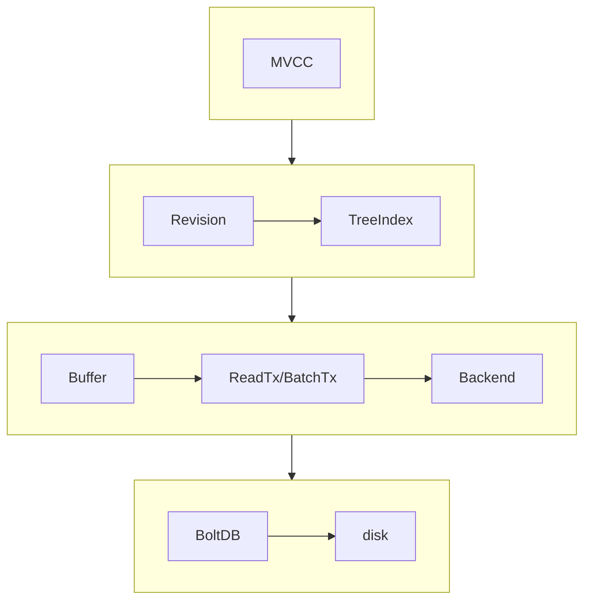
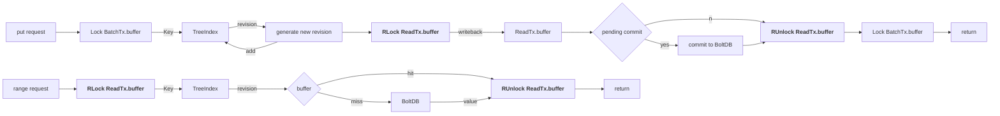
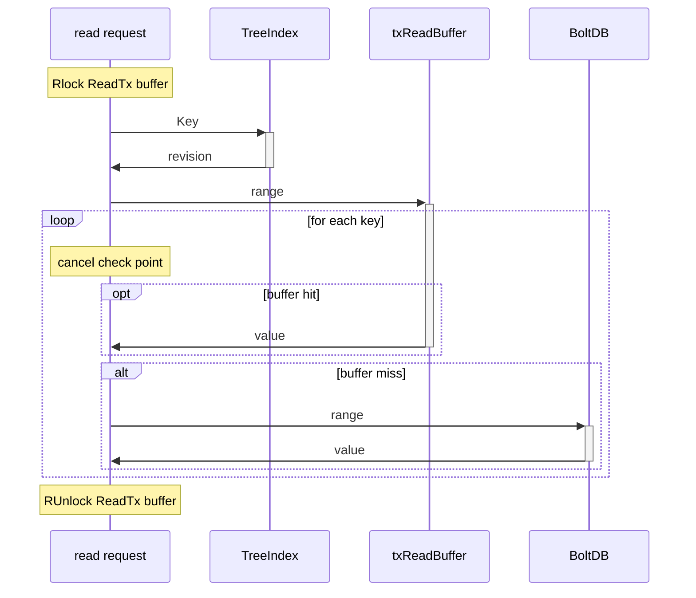
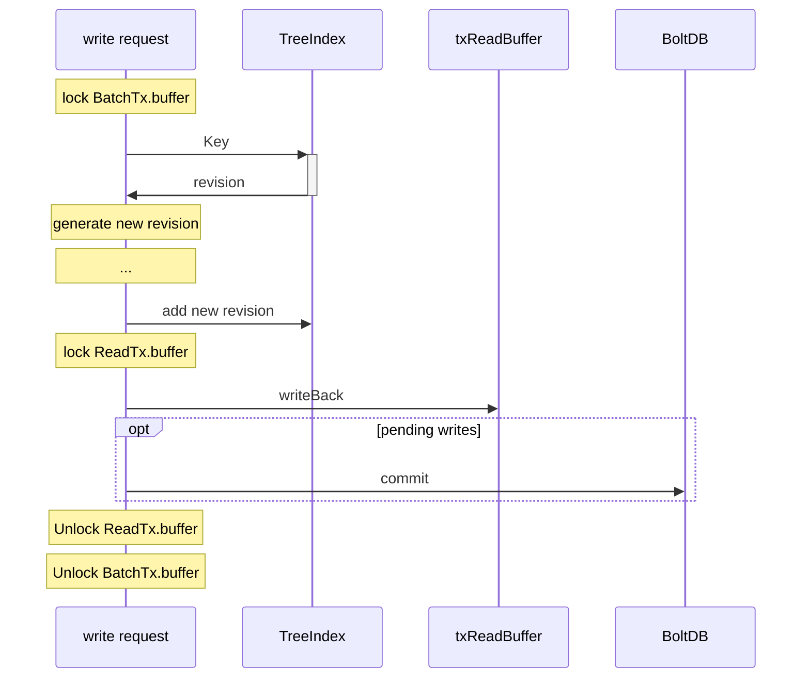
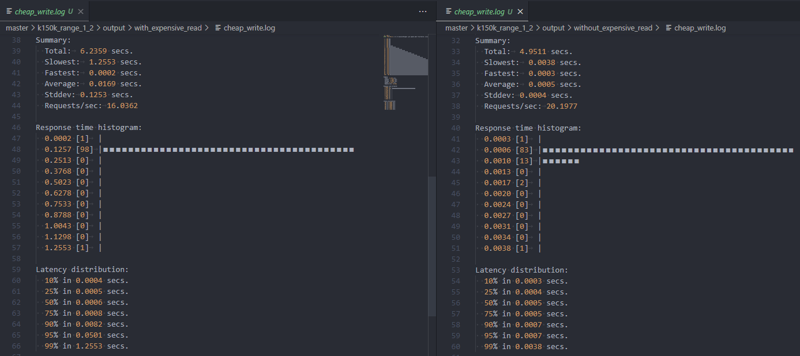
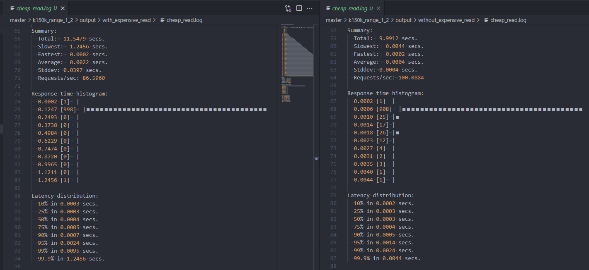
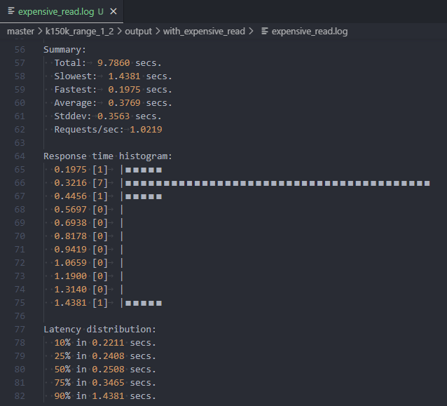

# README

## About The Project

Etcd3.3 doesn't support fully concurrent read. An expensive read would block cheap reads and writes. It's known that the read request of clients is applied as KV ```range``` requests in the server. The price of read is determined by the number of keys and value size for a single range request. Generally, the more keys it involves, and the larger the value size, the greater pressure it would apply to the database.  

This repo reproduces the [benchmark](https://github.com/etcd-io/etcd/pull/9384#issuecomment-462566915) for the PR [*allow fully concurrent read*](https://github.com/etcd-io/etcd/pull/9384), and explores the influence of cancellation expensive request.  

## Analysis

The expensive read request holds the read lock, which avoids the write request to acquire the write lock.  
Resolved by more fine-grained locks and more timely unlock.









## Benchmark Setup

- write 100k KVs with 256B keys and 1KB values
- 1 expensive read per second
- 100 cheap reads per second (<10keys)
- 20 writes per second (1 key)

## Expected Result

### For the result with cancellation, please refer to ```./master/k150k_range_1_2_e2```

Cheap write with concurrent expensive read is blocked significantly.

- expensive read request blocks cheap write request
  
- cheap read request is also blocked
 
- Note: expensive read is not extradinary even with 150k KV paris
  

## Reproduce

- ``Requirements``: Go environment
- To setup etcd server and client

  ```bash
  ./setup.sh
  ```

- To run etcd server with lock contention and proper cancel implemented

  ```bash
  ./cancel/bin/etcd
  ```
  
- To run etcd benchmark

  ```bash
  ./cancel/bin/benchmark
  ```

- The example cancellable API request script is in ```./API/cancel_study/```  
  To run the script

  ```bash
  go run ./API/cancel_study/ <expensive_read_TTL>
  ```

- The example test script is ```test.sh```  
  You may need to manually configure the output directory, and detect what kind of requests to run in the script

  ```bash
  ./test.sh <num_pairs>
  ```

- The example result is ```./master/k150k_range_1_2_e2```
