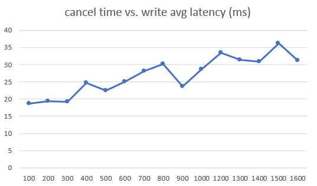
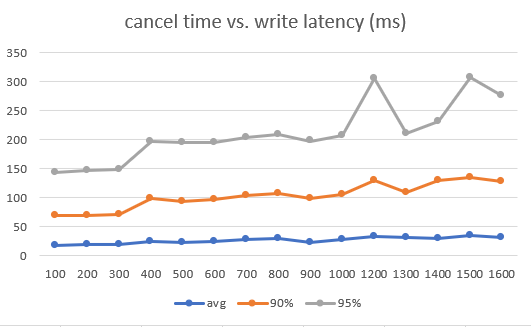

# etcd_cpu_limited

A case studying the effect of cancellation on etcd with limited CPU resource

## Experiment

This repo uses ```cgroup``` to constrain the CPU resource of etcd server, and tests the effect to cancel different requests.

### Setup

- write 100k KVs with 256B keys and 1KB values
- 1 expensive read per second
- 100 cheap reads per second (<10keys)
- 40 writes per second (1 key)

### Expected Result

- For detailed data with CPU restriction, please refer to ```./output_100k_cpu_10%```
- The response time of write request is directly linear with expensive read duration.
  
  
- The response time of cheap read request is not affected by the cpu restriction.
- It is not very helpful to cancel watch request when CPU is constrained. For detailed data, please refer to ```./output_100k_watch``` and ```./output_10k_watch```.
- Memory restriction to 8G doesn't affect response time.  

### Reproduce

- ```Requirements```: Go environment
- To set up etcd environment  
  ```./env_setup.sh```
- This repo uses ```cgroup``` to limit cpu utilization on linux. For ```cgroup``` configuration, please refer to the [install doc](https://www.geeksforgeeks.org/linux-virtualization-resource-throttling-using-cgroups/) and [usage doc](https://www.flamingbytes.com/blog/cgroup-limit-cpu/). It's suggested to run the test without CPU restriction first, and observe the CPU usage with cmd like ```top```, and then set a proper constraint.
- To run etcd directly  
  ```./etcd/bin/etcd```
- To run etcd benchmark
  ```./etcd/bin/benchmark```
- To set up etcd server with proper KV pairs (please run etcd server first)  
  ```./server_setup.sh <num_pairs>```
- The example cancellable API request script is in ```./etcd/cpu_study/```  
  To run the script  
  ```go run ./etcd/cpu_study <expensive_read_TTL_in_ms>```
- The example test script is ```test.sh```  
  ```./test.sh <expensive_read_TTL_in_ms>```
